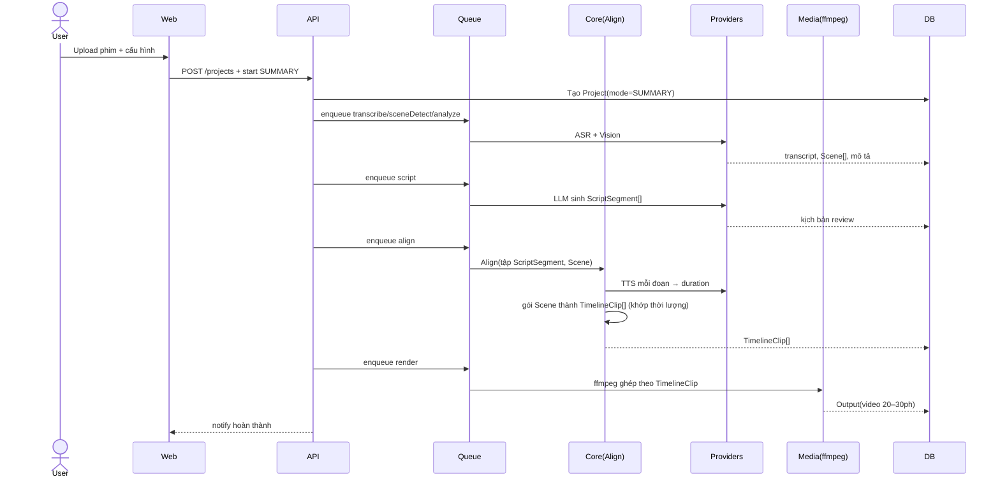

# 01 — Kiến trúc tổng thể

Tài liệu này là **trọng tâm** của bộ thiết kế: mô tả cấu trúc monorepo, luồng dữ liệu của hai pipeline,
mô hình Provider Pattern, hàng đợi và các sơ đồ trình tự.

---

## 1. Cấu trúc Monorepo (pnpm workspaces)

```
AI-Shorts-Factory/
├── apps/
│   ├── web/                  # Dashboard (React 19 + Vite)
│   └── api/                  # REST API (Express + TS)
├── packages/
│   ├── core/                 # Domain: entities, interfaces, orchestrator pipeline
│   ├── ai/                   # AIProvider (LLM) + Gemini/OpenAI/Anthropic/HuggingFace
│   ├── providers/
│   │   ├── asr/              # AsrProvider: Whisper / Faster-Whisper / OpenAI Whisper
│   │   ├── tts/              # TtsProvider: ElevenLabs / Google / Azure / OpenAI
│   │   ├── vision/           # VisionProvider: Gemini / CLIP (hiểu cảnh phim)
│   │   └── video-gen/        # (mở rộng) Kling/Hailuo/PixVerse...
│   ├── media/                # FFmpeg wrapper: transcode, scene-detect, concat, conform, grade
│   ├── queue/                # BullMQ + Redis: định nghĩa job, worker
│   ├── database/             # Prisma client + migrations
│   ├── shared/               # Zod schemas, types, constants, i18n
│   └── storage/              # Abstraction storage: local disk / S3
├── storage/                  # Volume lưu asset (images/audio/videos/subtitles/outputs)
├── docker/                   # Dockerfile, docker-compose, nginx
├── scripts/                  # migrate, seed, bench
└── docs/
```

**Quy tắc phụ thuộc (Dependency Rule):**
`apps/api` → `packages/core` → `packages/{ai,providers,media,queue,database,storage}` → `packages/shared`.
Lớp trên không được import implementation cụ thể của lớp dưới; chỉ qua **interface + DI**.

---

## 2. Tầng kiến trúc (Clean Architecture)

```
┌──────────────────────────────────────────────────────────┐
│ Presentation: apps/web (React)  +  apps/api (Controllers) │
├──────────────────────────────────────────────────────────┤
│ Application / Use-cases: services trong packages/core     │
│   - CreateProjectUseCase, SummaryPipeline, StyleEditPipeline│
├──────────────────────────────────────────────────────────┤
│ Domain: entities, interfaces (AIProvider, AsrProvider...)  │
├──────────────────────────────────────────────────────────┤
│ Infrastructure: providers/*, media, database, storage, queue│
└──────────────────────────────────────────────────────────┘
```

- **Controllers** (api) chỉ parse request, gọi use-case, trả response.
- **Use-cases** (core) chứa business logic, điều phối provider qua interface.
- **Infrastructure** cài đặt interface; được bơm (inject) vào core qua DI container.

---

## 3. Hai luồng pipeline

### 3.1. Mode `SUMMARY` (Review phim)

```
Phim (2–3h)
   │
   ▼  [ingest]        probe + tách audio + lưu source
   ▼  [transcribe]    ASR → transcript(timestamp)
   ▼  [scene-detect]  media → Scene[] (start/end/thumbnail)
   ▼  [analyze]       VisionProvider → mô tả mỗi Scene
   ▼  [script]        LLM → ScriptSegment[] (lời review + scene ref)
   ▼  [align] ★       TTS đoạn → duration; gói Scene thành TimelineClip[]
   ▼  [tts]           TtsProvider → Audio(giọng review)
   ▼  [subtitle]     sinh cues khớp TTS
   ▼  [render]        media/ffmpeg → Video 20–30 phút
   ▼  [upload?]       YouTube
```

### 3.2. Mode `STYLE_EDIT` (Edit theo mẫu)

```
Assets (ảnh/video/audio) + Video mẫu
   │
   ▼  [ingest]        lưu assets + template
   ▼  [style-analyze] media+Vision → StyleProfile (transition, nhịp, màu, motion, text)
   ▼  [storyboard]    LLM/core → Shot[] (asset + style áp dụng)
   ▼  [tts?]          TtsProvider (nếu có lời dẫn)
   ▼  [render]        media/ffmpeg → Video 30s–1phút theo StyleProfile
   ▼  [upload?]       YouTube
```

**Khác biệt cốt lõi:**
- `SUMMARY` cắt từ **1 video nguồn duy nhất** (phim) và phải đồng bộ giọng ↔ cảnh (stage `align`).
- `STYLE_EDIT` **soạn từ nhiều assets rời** theo **phong cách học được** từ video mẫu; không cần đồng bộ với nguồn.

---

## 4. Provider Pattern

Mọi dịch vụ ngoài được trừu tượng hoá qua interface. Ví dụ `TtsProvider`:

```ts
// packages/providers/tts/types.ts
export interface TtsProvider {
  readonly id: string;                 // 'elevenlabs' | 'google' | 'azure' | 'openai'
  synthesize(input: TtsInput): Promise<TtsResult>;
}

export interface TtsInput {
  text: string;
  language: string;                   // 'vi', 'en'...
  voiceId?: string;
  speed?: number;                     // 0.9–1.1
}

export interface TtsResult {
  audioKey: string;                   // storage key
  durationSec: number;                // ★ thời lượng CHÍNH XÁC (dùng cho align)
  provider: string;
  model: string;
  meta?: Record<string, unknown>;
}
```

Tương tự: `AIProvider` (LLM), `AsrProvider` (transcribe), `VisionProvider` (mô tả cảnh).

**Registry + Strategy:** dùng DI container ánh xạ `providerId → implementation`. Use-case chỉ gọi
`container.resolve('tts', settings.voiceProvider)`. Thêm provider = thêm 1 file implement + đăng ký,
**không sửa** business logic.

---

## 5. Hàng đợi (BullMQ + Redis)

Mỗi stage là 1 loại job. Worker tiêu thụ song song, retry tự động.

```
API ──enqueue──▶ Redis/BullMQ ──▶ Worker (per stage)
                        │
                        └─▶ GenerationJob (DB) gương trạng thái + log
```

| Job type | Stage | Retry |
| --- | --- | --- |
| `summary.transcribe` | ASR | 3, exp backoff |
| `summary.sceneDetect` | media | 2 |
| `summary.analyze` | vision | 3 |
| `summary.script` | llm | 3 |
| `summary.align` | core | 2 |
| `summary.tts` | tts | 3 |
| `summary.subtitle` | media | 2 |
| `summary.render` | media | 2 |
| `style.analyze` | media+vision | 3 |
| `style.storyboard` | llm/core | 3 |
| `style.render` | media | 2 |
| `output.uploadYoutube` | api | 2 |

Mỗi job **idempotent**: key theo `(projectId, stage)`. Thất bại → tự động retry; hết retry → đánh dấu
`GenerationJob.status = FAILED` và thông báo user.

---

## 6. Sơ đồ trình tự (Sequence) — SUMMARY



---

## 7. Storage Abstraction

`packages/storage` định nghĩa `StorageProvider` (`put`, `get`, `delete`, `signedUrl`).
MVP cài đặt `LocalStorage` (ghi vào `storage/`), production cài đặt `S3Storage`.
Mọi asset (phim nguồn, scene, audio, video, subtitle, output) lưu qua abstraction → dễ đổi hạ tầng.

---

## 8. Quyết định thiết kế (Design Decisions)

| Quyết định | Lý do |
| --- | --- |
| Tách `script` và `scene selection` nhưng gộp ở `align` | Đảm bảo giọng ↔ cảnh đồng bộ từ **cùng một biên thời gian** |
| TTS trả `durationSec` chính xác | Làm Input cho `align`, tránh đoán thời lượng |
| Scene detect local (ffmpeg) + Vision mô tả | Nhanh, rẻ, không phụ thuộc API đắt |
| StyleProfile tách biệt assets | Tái dùng mẫu cho nhiều project |
| Job idempotent + DB mirror | Quan sát & tiếp tục từ stage lỗi |
| Monorepo pnpm | Chia sẻ type/Zod giữa web & api, build nhất quán |
