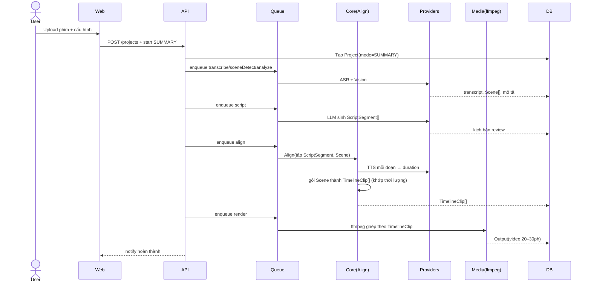
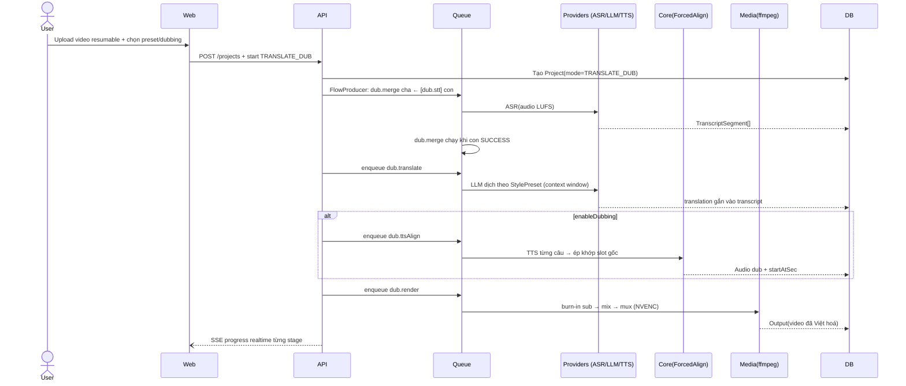

# 01 — Kiến trúc tổng thể

# Current Implementation (CURRENT)

- layout `backend/`+`frontend/` phẳng JS ESM (không apps/packages)
- DB sql.js/SQLite file backend/data.db + schema backend/src/db/schema.js
- pipeline backend/src/pipeline/runner.js sequential (SUMMARY 8 stages, TRANSLATE_DUB 6 stages [dub.ingest,dub.stt,dub.merge,dub.translate,dub.ttsAlign,dub.render]), không BullMQ per-stage
- queue BullMQ+Redis chỉ cho projectQueue/notifyQueue/cleanupQueue

# Target Architecture (FUTURE — NOT IMPLEMENTED)

> Mọi nội dung phía dưới là thiết kế tương lai (giữ nguyên, không xóa); chỉ các đoạn gắn nhãn CURRENT/PARTIAL mới phản ánh code hiện tại trên branch main.

> **Lưu ý Triển khai:** Tài liệu này mô tả thiết kế target (monorepo với `apps/` + `packages/`).
> Triển khai hiện tại dùng cấu trúc phẳng `backend/` + `frontend/` với JavaScript (không TypeScript).
> Xem `docs/superpowers/plans/` cho chi tiết gap giữa thiết kế và triển khai.

Tài liệu này là **trọng tâm** của bộ thiết kế: mô tả cấu trúc monorepo, luồng dữ liệu của hai pipeline,
mô hình Provider Pattern, hàng đợi và các sơ đồ trình tự.

---

## 1. Cấu trúc Monorepo (pnpm workspaces) [TARGET/FUTURE]

```
AI-Shorts-Factory/
├── apps/
│   ├── web/                  # Dashboard (React 19 + Vite)
│   └── api/                  # REST API (Express + TS)
├── packages/
│   ├── core/                 # Domain: entities, interfaces, orchestrator pipeline
│   ├── ai/                   # AIProvider (LLM) + Gemini/OpenAI/Anthropic/HuggingFace
│   ├── providers/
│   │   ├── asr/              # AsrProvider: Whisper / Faster-Whisper / OpenAI Whisper
│   │   ├── tts/              # TtsProvider: ElevenLabs / Google / Azure / OpenAI
│   │   ├── vision/           # VisionProvider: Gemini / CLIP (hiểu cảnh phim)
│   │   └── video-gen/        # (mở rộng) Kling/Hailuo/PixVerse...
│   ├── media/                # FFmpeg wrapper: transcode, scene-detect, concat, conform, grade
│   ├── queue/                # BullMQ + Redis: định nghĩa job, worker
│   ├── database/             # Prisma client + migrations
│   ├── shared/               # Zod schemas, types, constants, i18n
│   └── storage/              # Abstraction storage: local disk / S3
├── storage/                  # Volume lưu asset (images/audio/videos/subtitles/outputs)
├── docker/                   # Dockerfile, docker-compose, nginx
├── scripts/                  # migrate, seed, bench
└── docs/
```

**Quy tắc phụ thuộc (Dependency Rule):**
`apps/api` → `packages/core` → `packages/{ai,providers,media,queue,database,storage}` → `packages/shared`.
Lớp trên không được import implementation cụ thể của lớp dưới; chỉ qua **interface + DI**.

---

## 2. Tầng kiến trúc (Clean Architecture) [TARGET/FUTURE]

```
┌──────────────────────────────────────────────────────────┐
│ Presentation: apps/web (React)  +  apps/api (Controllers) │
├──────────────────────────────────────────────────────────┤
│ Application / Use-cases: services trong packages/core     │
│   - CreateProjectUseCase, SummaryPipeline, TranslateDubPipeline│
├──────────────────────────────────────────────────────────┤
│ Domain: entities, interfaces (AIProvider, AsrProvider...)  │
├──────────────────────────────────────────────────────────┤
│ Infrastructure: providers/*, media, database, storage, queue│
└──────────────────────────────────────────────────────────┘
```

- **Controllers** (api) chỉ parse request, gọi use-case, trả response.
- **Use-cases** (core) chứa business logic, điều phối provider qua interface.
- **Infrastructure** cài đặt interface; được bơm (inject) vào core qua DI container.

---

## 3. Hai luồng pipeline

### 3.1. Mode `SUMMARY` (Review phim)

```
Phim (2–3h)
   │
   ▼  [ingest]        probe + tách audio + lưu source
   ▼  [transcribe]    ASR → transcript(timestamp)
   ▼  [scene-detect]  media → Scene[] (start/end/thumbnail)
   ▼  [analyze]       VisionProvider → mô tả mỗi Scene
   ▼  [script]        LLM → ScriptSegment[] (lời review + scene ref)
   ▼  [align] ★       TTS đoạn → duration; gói Scene thành TimelineClip[]
   ▼  [tts]           TtsProvider → Audio(giọng review)
   ▼  [subtitle]     sinh cues khớp TTS
   ▼  [render]        media/ffmpeg → Video 20–30 phút
   ▼  [upload?]       YouTube
```

### 3.2. Mode `TRANSLATE_DUB` (Dịch thuật & Lồng tiếng)

```
Video nước ngoài
   │
   ▼  [ingest]        resumable upload → demux (audio/video) → normalize LUFS
   ▼  [stt]           ASR → transcript(timestamp, speaker)
   ▼  [merge]         Kiểm tra barrier: transcript + translation + duration + language
   ▼  [translate]     LLM + StylePreset(13 phong cách) → bản dịch khớp context window
   ▼  [ttsAlign?]     TTS + Forced Alignment khớp slot gốc (tuỳ chọn enableDubbing)
   ▼  [render]        Burn-in sub mới → audio mix (dub voice + nền) → mux MP4/MKV (NVENC)
   ▼  [upload?]       YouTube
```

**Khác biệt cốt lõi:**
- `SUMMARY` cắt từ **1 video nguồn duy nhất** (phim) và phải đồng bộ giọng ↔ cảnh (stage `align`);
  đầu ra là **video mới dựng** từ các cảnh trích.
- `TRANSLATE_DUB` **giữ nguyên hình ảnh gốc**, chỉ thay lớp ngôn ngữ: phụ đề dịch mới được burn-in
  và (tuỳ chọn) giọng lồng AI ép khớp timestamp.

---

## 4. Provider Pattern [TARGET/FUTURE]

> [TARGET/FUTURE] — Interface TypeScript trong `packages/` là thiết kế tương lai. CURRENT: provider JS trong `backend/src/providers/` (xem `11_RATE_LIMIT_VA_FREE_TIER.md` cho RateLimiter + ProviderCache hiện tại).

Mọi dịch vụ ngoài được trừu tượng hoá qua interface. Ví dụ `TtsProvider`:

```ts
// packages/providers/tts/types.ts
export interface TtsProvider {
  readonly id: string;                 // 'elevenlabs' | 'google' | 'azure' | 'openai'
  synthesize(input: TtsInput): Promise<TtsResult>;
}

export interface TtsInput {
  text: string;
  language: string;                   // 'vi', 'en'...
  voiceId?: string;
  speed?: number;                     // 0.9–1.1
}

export interface TtsResult {
  audioKey: string;                   // storage key
  durationSec: number;                // ★ thời lượng CHÍNH XÁC (dùng cho align)
  provider: string;
  model: string;
  meta?: Record<string, unknown>;
}
```

Tương tự: `AIProvider` (LLM), `AsrProvider` (transcribe + word timestamps + diarization),
`VisionProvider` (mô tả cảnh / AI inpainting).

**Registry + Strategy:** dùng DI container ánh xạ `providerId → implementation`. Use-case chỉ gọi
`container.resolve('tts', settings.voiceProvider)`. Thêm provider = thêm 1 file implement + đăng ký,
**không sửa** business logic.

> ⚠️ Mọi cuộc gọi qua provider thật (LLM/ASR/TTS/Vision) đều đi qua lớp `RateLimiter` +
> `ProviderCache` trước khi chạm mạng, đặc biệt quan trọng khi user dùng **API key miễn phí**
> (RPM/RPD thấp). Xem chi tiết cơ chế throttle, cache, đa key round-robin và provider `mock` cho
> dev/CI tại `11_RATE_LIMIT_VA_FREE_TIER.md`.

---

## 5. Hàng đợi (BullMQ + Redis) [TARGET/FUTURE]

> [TARGET/FUTURE] — Job per-stage + worker song song mỗi stage là thiết kế tương lai.
> CURRENT: pipeline chạy sequential trong `backend/src/pipeline/runner.js`; BullMQ + Redis chỉ dùng cho 3 queue `projects`/`notifications`/`cleanup` (`backend/src/queue/projectQueue.js`, `notifyQueue.js`, `cleanupQueue.js`).

Mỗi stage là 1 loại job. Worker tiêu thụ song song, retry tự động.

```
API ──enqueue──▶ Redis/BullMQ ──▶ Worker (per stage)
                        │
                        └─▶ GenerationJob (DB) gương trạng thái + log
```

| Job type | Stage | Retry |
| --- | --- | --- |
| `summary.transcribe` | ASR | 3, exp backoff |
| `summary.sceneDetect` | media | 2 |
| `summary.analyze` | vision | 3 |
| `summary.script` | llm | 3 |
| `summary.align` | core | 2 |
| `summary.tts` | tts | 3 |
| `summary.subtitle` | media | 2 |
| `summary.render` | media | 2 |
| `dub.ingest` | media (demux + LUFS) | 2 |
| `dub.stt` | asr (+ diarization) | 3 |
| `dub.merge` | api (barrier, không gọi provider) | 1 |
| `dub.translate` | llm + StylePreset | 3 |
| `dub.ttsAlign` | tts + ForcedAlignService | 3 |
| `dub.render` | media (burn-in/mix/mux) | 2 |
| `output.uploadYoutube` | api | 2 |

> Riêng các job gọi provider bên ngoài (`summary.analyze`, `summary.script`, `summary.tts`,
> `dub.stt`, `dub.translate`, `dub.ttsAlign`), khi provider trả `429`/hết quota, job
> chuyển `RETRY` với `nextRetryAt` theo lịch reset của provider (không phải backoff cố định như
> bảng trên) — xem `11_RATE_LIMIT_VA_FREE_TIER.md` §4.2.

Mỗi job **idempotent**: key theo `(projectId, stage)`. Thất bại → tự động retry; hết retry → đánh dấu
`GenerationJob.status = FAILED` và thông báo user.

### 5.1. Cơ chế barrier `dub.stt` → `dub.merge` → `dub.translate` [TARGET/FUTURE]

BullMQ không có "chờ 2 job cha" built-in một cách an toàn nếu chỉ dùng `Promise.all` phía API (rủi ro
mất trạng thái nếu API restart giữa chừng). Thiết kế dùng **BullMQ Flow Producer**:

```
FlowProducer.add({
  name: 'dub.merge',
  queue: 'dub',
  children: [
    { name: 'dub.stt', queue: 'dub', data: { projectId } },
  ],
});
```

- `dub.merge` là job cha, chỉ chạy khi job con `dub.stt` hoàn tất thành công
  (BullMQ tự động chờ, lưu trạng thái trong Redis — sống sót qua restart API).
- `dub.merge` không gọi provider, chỉ kiểm tra `TranscriptSegment[]` đã có trong DB
  rồi enqueue tiếp `dub.translate`.
- Nếu job con `FAILED` sau hết retry, `dub.merge` không chạy → `Project.status = FAILED`,
  hiển thị đúng job nào lỗi để user retry thủ công (`POST /projects/:id/jobs/:type/retry`).

### 5.2. Huỷ (Cancel) và thông báo hoàn thành [PARTIAL]

- **Cancel**: `POST /projects/:id/cancel` → API gọi `job.remove()` cho mọi job `PENDING` của project
  trong BullMQ và gửi tín hiệu dừng cho job `RUNNING` (worker kiểm tra cờ `cancelled` định kỳ giữa các
  bước con, đặc biệt trong FFmpeg — dùng `child_process.kill()` an toàn). `GenerationJob.status` các
  job liên quan chuyển `FAILED` với `error = 'CANCELLED_BY_USER'`; file tạm được dọn ngay.
- **Thông báo**: khi `Project.status` chuyển `SUCCESS`/`FAILED`, hệ thống enqueue job nhẹ
  `notify.projectDone` gửi email (hoặc push nếu có) cho user — không phụ thuộc SSE, để user không
  cần giữ tab mở với pipeline dài (2–3h phim SUMMARY).

---

## 6. Sơ đồ trình tự (Sequence) — SUMMARY



### 6.1. Sơ đồ trình tự — TRANSLATE_DUB [PARTIAL]

> [PARTIAL] — Luồng stage đúng với `STAGES.TRANSLATE_DUB` trong `backend/src/pipeline/runner.js:111-154`; riêng `FlowProducer: dub.merge cha ← [dub.stt] con` là [TARGET/FUTURE] (CURRENT chạy sequential, không BullMQ Flow).



---

## 7. Storage Abstraction [TARGET/FUTURE]

> [TARGET/FUTURE] — `packages/storage` + `S3Storage` là thiết kế tương lai. CURRENT: lưu file local qua `backend/src/pipeline/context.js` (`projectDir`/`resolveStorageKey`).

`packages/storage` định nghĩa `StorageProvider` (`put`, `get`, `delete`, `signedUrl`).
MVP cài đặt `LocalStorage` (ghi vào `storage/`), production cài đặt `S3Storage`.
Mọi asset (phim nguồn, scene, audio, video, subtitle, output) lưu qua abstraction → dễ đổi hạ tầng.

---

## 8. Error Handling Pattern (Bổ sung)

### 8.1. Retry Policy per Stage Group

| Stage Group | Max Retry | Delay | Retryable Errors |
| --- | --- | --- | --- |
| `EXTRACT_AUDIO` | 3 | 5s, 15s, 30s | Timeout, 5xx, network error |
| `STT` | 3 | 10s, 30s, 60s | Timeout, 429 (rate limit), 5xx |
| `TRANSLATE` | 3 | 5s, 15s, 30s | Timeout, 429, 5xx, invalid JSON |
| `SUMMARIZE` | 3 | 5s, 15s, 30s | Timeout, 429, 5xx, business rule violation |
| `TTS` | 3 | 10s, 30s, 60s | Timeout, voice not found, 5xx |
| `RENDER` | 2 | 30s, 120s | FFmpeg crash, disk full, timeout |

**Non-retryable errors** (FAILED ngay, không retry):
- `PROVIDER_AUTH_FAILED`: API key sai/hết hạn → user cần cập nhật key
- `PROVIDER_QUOTA_EXCEEDED`: Hết quota provider → user cần upgrade plan
- `INPUT_INVALID`: File video corrupt, codec không hỗ trợ
- `BUSINESS_RULE_VIOLATION`: Dịch quá dài/ngắn so với slot (không phải lỗi provider)

**Exponential backoff**: Delay tăng theo `baseDelay * 2^attempt`, max `baseDelay * 8`.

### 8.2. Idempotent Callback

- Worker gửi callback về backend PHẢI chứa `(jobId, stage, status, outputRef)` + timestamp.
- Backend kiểm tra: nếu `(jobId, stage)` đã ở trạng thái `COMPLETED` với `outputRef` trùng khớp →
  ACK lại ngay, không xử lý lại (idempotent).
- Nếu `outputRef` khác → coi như rerun mới, xử lý bình thường.

### 8.3. SSE vs Polling Choice

| Phương án | Ưu điểm | Nhược điểm | Khi nào dùng |
| --- | --- | --- | --- |
| **SSE (Server-Sent Events)** | Real-time, server push, đơn giản | Kết nối 1 chiều, không retry tự động | UI dashboard hiển thị progress pipeline |
| **Polling** | Đơn giản, fault-tolerant | Delay, lãng phí bandwidth | Fallback khi SSE không khả dụng |
| **WebSocket** | Full-duplex, bidirectional | Phức tạp hơn, cần quản lý connection | Chat, collaborative editing (tương lai) |

**Quyết định**: Dùng **SSE** cho progress pipeline (vì chỉ cần server push 1 chiều).
Khi SSE mất kết nối → frontend tự poll lại `/projects/:id/status` sau 5s.

### 8.4. Stage State Machine [TARGET/FUTURE]

> [TARGET/FUTURE] — State machine `MediaJob`/`MediaJobStage` với `STALE`/`SKIPPED`/`CANCEL_REQUESTED` là thiết kế tương lai, NOT IMPLEMENTED trong code hiện tại (không có bảng MediaJobStage trong `backend/src/db/schema.js`).
>
> CURRENT: `generation_jobs.status` + `projects.status` dùng enum lowercase: pending/queued/running/completed/failed/cancelled (xem `backend/src/pipeline/runner.js`, `backend/src/usecases/cancelProjectUseCase.js`).

Mỗi Stage trong MediaJob [TARGET/FUTURE] đi qua các trạng thái:

```
PENDING → PROCESSING → COMPLETED
                 ↓
               FAILED (→ retry nếu còn lượt)
                 ↓
               STALE (khi dependency upstream thay đổi)
```

| Trạng thái | Ý nghĩa |
| --- | --- |
| `PENDING` | Chưa bắt đầu, chờ dependency hoặc queue |
| `PROCESSING` | Đang chạy (provider call, FFmpeg, v.v.) |
| `COMPLETED` | Thành công, output đã lưu DB |
| `FAILED` | Lỗi — có thể retry nếu chưa vượt max retry |
| `STALE` [TARGET/FUTURE] | Đã completed nhưng dependency upstream thay đổi → cần rerun |
| `SKIPPED` [TARGET/FUTURE] | Bỏ qua (vd: user tắt dubbing → Stage TTS được skip) |
| `CANCEL_REQUESTED` [TARGET/FUTURE] | User yêu cầu huỷ — đang chờ graceful shutdown |
| `CANCELLED` | Đã huỷ hoàn toàn |

**Quy tắc STALE**: Khi user thay đổi `sourceLanguage` sau khi STT đã COMPLETED → Stage STT được rerun;
các Stage `TRANSLATE`/`TTS` (nếu đã COMPLETED trước đó) → chuyển `STALE`, yêu cầu rerun. |


---

## 8. Quyết định thiết kế (Design Decisions)

| Quyết định | Lý do |
| --- | --- |
| Tách `script` và `scene selection` nhưng gộp ở `align` | Đảm bảo giọng ↔ cảnh đồng bộ từ **cùng một biên thời gian** |
| TTS trả `durationSec` chính xác | Làm Input cho `align`, tránh đoán thời lượng |
| Burn-in sub mới thay vì mask hardsub | Đơn giản hóa pipeline, giảm thời gian render, không cần OCR |
| StylePreset lưu DB (không hardcode) | Thêm/sửa phong cách dịch không phải deploy lại code |
| Job idempotent + DB mirror | Quan sát & tiếp tục từ stage lỗi |
| [TARGET/FUTURE] Monorepo pnpm | Chia sẻ type/Zod giữa web & api, build nhất quán |
| [TARGET/FUTURE] BullMQ Flow Producer cho `dub.merge` | Barrier an toàn qua restart, thay vì `Promise.all` phía API (dễ mất trạng thái) |
| Job huỷ được (cancel) | Tránh lãng phí tài nguyên GPU/CPU khi user đổi ý giữa pipeline dài |
| Thông báo qua email/push, không chỉ SSE | Pipeline SUMMARY có thể chạy 20–30 phút, user không nhất thiết giữ tab mở |
| Rate Limiter + Cache bọc mọi provider thật | Free-tier API key (Gemini/OpenAI/ElevenLabs...) có RPM/RPD rất thấp; không throttle chủ động sẽ vỡ pipeline liên tục khi test nhiều lần (`11`) |
| SSE thay vì WebSocket cho progress | Pipeline chỉ cần server push 1 chiều; SSE đơn giản hơn, không cần quản lý connection state |
| Idempotent callback từ Worker | Tránh xử lý lại khi worker gửi duplicate callback (do network timeout) |
| Graceful cancellation | Stage `PENDING` → `CANCELLED` ngay; Stage `PROCESSING` → đợi provider hoặc timeout 60s |
| [NOT IMPLEMENTED] Media Consent versioned | Khi Terms version thay đổi → cần re-consent; asset cũ vẫn dùng được cho Jobs đang chạy |
