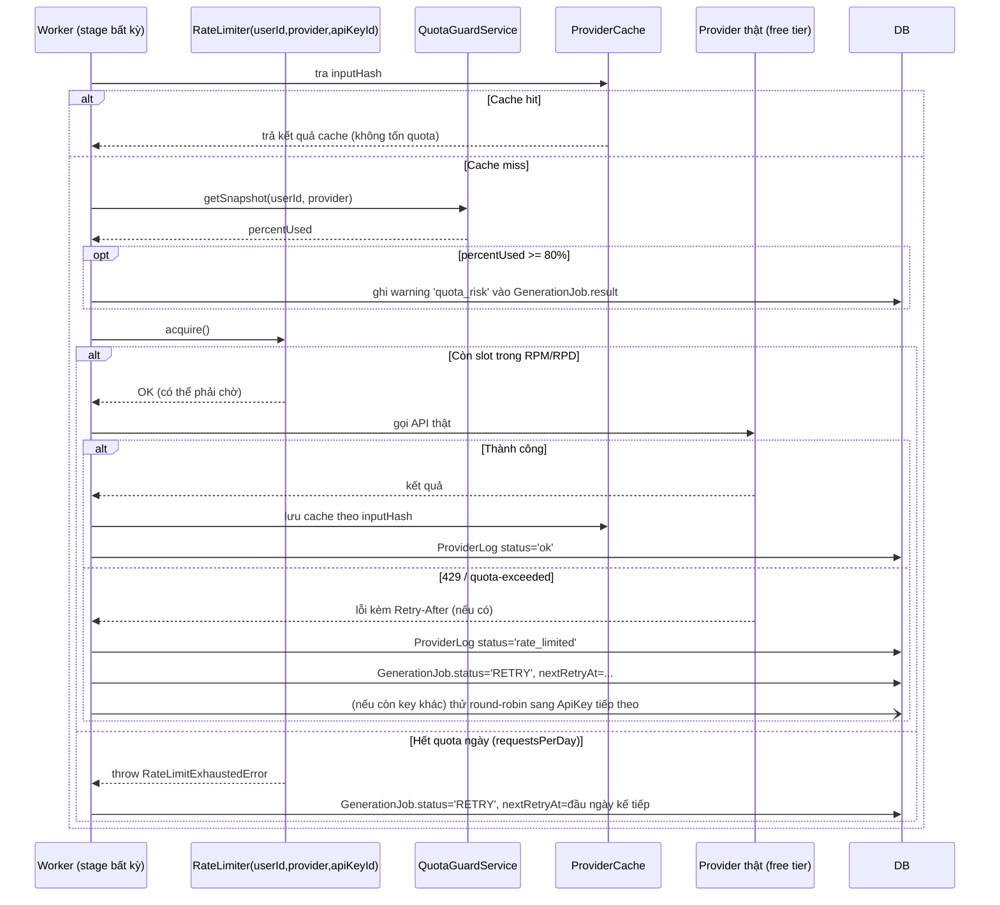

# 11 — Rate Limiting & Khả năng vận hành ổn định với API Key miễn phí

Tài liệu này bổ sung cho `01_KIEN_TRUC_TONG_THE.md` (Provider Pattern) và `03_THIET_KE_BACKEND.md`,
nhằm đảm bảo hệ thống **chạy được nhiều lần, liên tục, không vỡ pipeline** khi user dùng
**API key miễn phí** (Gemini free tier, OpenAI free trial, ElevenLabs free, HuggingFace Inference
free, Google TTS free quota...) — vốn có giới hạn **rất thấp** về số request/phút (RPM), số
request/ngày (RPD) và tổng token/ký tự/tháng.

Đây là mối lo hợp lý: pipeline SUMMARY/TRANSLATE_DUB hiện tại (`05`) gọi provider theo kiểu
**"nổ dồn dập"** (mỗi Scene 1 lần gọi Vision, mỗi ScriptSegment/TranscriptSegment 1 lần gọi
TTS/LLM) — nếu không kiểm soát, một phim 2–3h dễ dàng sinh ra **hàng trăm cuộc gọi** trong vài phút
và chắc chắn dính lỗi `429 Too Many Requests` hoặc cạn quota tháng giữa chừng.

# Current Implementation (CURRENT)

- [CURRENT] `RateLimiter` TokenBucket + SlidingWindow + daily cap theo `(userId, provider, apiKeyId)`, in-memory per-process (`backend/src/lib/rateLimiter.js:30-122,166-172`): `acquire()` chờ theo RPM, throw `RateLimitExhaustedError` khi chạm RPD, `markRateLimited()` freeze bucket 10s.
- [CURRENT] Gemini per-key sliding-window (`backend/src/providers/rateLimit.js:18-51`, `GEMINI_RPM` mặc định 10) + `generateContent` dùng đúng độ trễ `Retry-After` / `retry in Xs` kết hợp backoff 1s→30s, cap 60s (`backend/src/providers/geminiClient.js:106-116`), budget `GEMINI_MAX_RETRIES` mặc định 5.
- [CURRENT] `ProviderCache` SHA-256 `(provider + type + model + normalized input)` + TTL 90 ngày (`backend/src/lib/callProvider.js:37-86,127-156`); [PARTIAL] bỏ qua config `providerCacheEnabled`/`providerCacheTtlDays` (`backend/src/config.js:46-47`).
- [CURRENT] Fallback theo segment: OCR thiếu key → Tesseract local (`backend/src/providers/registry.js:160-164`), EdgeTTS lỗi → Google TTS (`backend/src/providers/tts/edgeTts.js:42-50`), GT lỗi → LLM direct + restyle có fallback (`backend/src/pipeline/stages/dubTranslate.js:153-212`), loudnorm lỗi → copy audio thô (`backend/src/pipeline/stages/dubIngest.js:34-38`), NVENC lỗi → libx264 (`backend/src/media/mediaService.js:491-503`).
- [CURRENT] 429 park: `next_retry_at = now + 60s` (`backend/src/pipeline/runner.js:38-45`), MAX 5 lần (`runner.js:408-414`), project về `queued` chờ resume (`runner.js:277-280`).
- [PARTIAL] `callProvider` hardcode `rpm: 10` (`backend/src/lib/callProvider.js:139-143`), bỏ qua bảng `provider_rate_limits` và `providerRateLimitSafetyMargin` (`backend/src/config.js:45`).
- [PARTIAL] `backend/src/services/quotaGuardService.js` (chữ `q` thường) chỉ được wired tới `GET /providers/:provider/quota` (`backend/src/routes/v1/providers.js:83-91`); không pre-check pipeline, không injection `quota_risk` vào job.
- [NOT IMPLEMENTED] Round-robin đa key + cooldown: `resolveApiKey` chỉ lấy key đầu giải mã được (`backend/src/providers/registry.js:115-131`), không round-robin/cooldown; `selectBestApiKey` check per-key không hiệu quả (đếm `rate_limited` chung provider + snapshot chung user/provider) và là dead code (không caller).

> Mọi nội dung phía dưới không gắn nhãn [CURRENT]/[PARTIAL] là thiết kế tương lai [TARGET/FUTURE]; đường dẫn `packages/*` + Prisma là [TARGET], CURRENT là `backend/src/**/*.js` + SQLite (`backend/src/db/schema.js`).

---

## 1. Nguyên tắc thiết kế

| Nguyên tắc | Ý nghĩa |
| --- | --- |
| **Throttle tại nguồn, không phải retry mù** | Biết trước giới hạn RPM/RPD của mỗi provider → chủ động giãn cách request, thay vì bắn hết rồi bắt lỗi 429 |
| **Cache để không gọi lại cái đã gọi** | Idempotent job + input giống nhau → trả kết quả cũ, không tốn quota |
| **Tôn trọng tín hiệu từ provider** | Luôn đọc header `Retry-After` / `X-RateLimit-*` nếu có, không đoán mù thời gian chờ |
| **Không im lặng khi cạn quota** | Cảnh báo **trước** khi cạn (ngưỡng 80%), không chỉ báo lỗi sau khi đã cạn |
| **Suy giảm nhẹ nhàng (graceful degradation)** | Hết quota provider A → tự chuyển provider B cùng loại (nếu user cấu hình) thay vì FAILED cứng |
| **Batch thay vì lặp từng đơn vị nhỏ** | Gom nhiều Scene/Segment vào 1 request khi API hỗ trợ, giảm số lần gọi tuyệt đối |

---

## 2. Rate Limiter theo Provider (packages/ai, packages/providers/*) [TARGET — CURRENT là `backend/src/lib/rateLimiter.js` + `backend/src/providers/rateLimit.js`, không `packages/*`]

### 2.1. Cấu hình giới hạn đã biết (seed cứng + override qua DB) [PARTIAL]

Mỗi provider có **profile giới hạn** lưu ở bảng `ProviderRateLimit` (mới), seed sẵn giá trị an toàn
cho các gói **free tier phổ biến**, user có thể override khi nhập API key riêng (biết rõ gói mình dùng):

```prisma
model ProviderRateLimit {
  id            String   @id @default(uuid())
  provider      String   // 'gemini' | 'openai' | 'elevenlabs' | 'huggingface'...
  tier          String   @default("free")   // 'free' | 'paid' | 'custom'
  requestsPerMinute Int
  requestsPerDay    Int?
  tokensPerMinute   Int?
  concurrency       Int      @default(1)    // số request đồng thời tối đa
  userId        String?  // null = mặc định hệ thống; có giá trị = override riêng của user
  updatedAt     DateTime @updatedAt
}
```

Giá trị seed mặc định (tham khảo, **cấu hình được qua Admin/Settings**, không hardcode trong code
business logic — đúng NFR-3 Extensible):

> [PARTIAL] — Seed `provider_rate_limits` đã có (`backend/src/db/schema.js:351-362`: gemini free 10/250/1...). [NOT IMPLEMENTED] override per-user qua DB + `providerRateLimitSafetyMargin` (`backend/src/config.js:45`) chưa được `callProvider` đọc (hardcode `rpm: 10` ở `callProvider.js:139-143`).

| Provider | Tier | RPM | RPD | Concurrency |
| --- | --- | --- | --- | --- |
| gemini | free | 10 | 250 | 1 |
| openai | free-trial | 3 | 200 | 1 |
| elevenlabs | free | 2 | — (giới hạn theo ký tự/tháng) | 1 |
| huggingface | free | 5 | — | 1 |
| azure-tts | free | 20 | — | 2 |

> Các giá trị này **thấp hơn thực tế công bố của nhà cung cấp một chút** (an toàn margin ~20%) vì
> free tier hay thay đổi và không có SLA — mục tiêu là **không bao giờ chạm ngưỡng cứng**.

### 2.2. TokenBucket / Sliding Window Limiter [CURRENT]

> [CURRENT] — `backend/src/lib/rateLimiter.js:30-122` (TokenBucket + SlidingWindow + daily) per `(userId, provider, apiKeyId)` in-memory; Gemini dùng thêm per-key window riêng (`backend/src/providers/rateLimit.js:18-51`). Câu `packages/ai` + `RateLimitedClient` là [TARGET].

`packages/ai` và mỗi `packages/providers/*` bọc lời gọi provider qua 1 lớp `RateLimitedClient`
dùng thuật toán **Token Bucket** (cho phép burst nhỏ trong giới hạn) kết hợp **Sliding Window**
(chặn cứng khi chạm RPD):

```ts
// packages/shared/rate-limit/token-bucket.ts
export interface RateLimiterOptions {
  requestsPerMinute: number;
  requestsPerDay?: number;
  concurrency: number;
}

export interface RateLimiter {
  // Chờ đến khi có "chỗ trống" mới resolve; không bao giờ throw vì hết slot,
  // chỉ throw khi hết hạn mức NGÀY (requestsPerDay) — trường hợp đó phải dừng hẳn job.
  acquire(): Promise<void>;
  release(): void;
  getUsageSnapshot(): { usedThisMinute: number; usedToday: number; remainingToday: number };
}
```

- Mỗi cặp `(userId, provider)` có 1 instance `RateLimiter` riêng (không dùng chung giữa các user
  để tránh 1 user chậm ảnh hưởng user khác dùng key riêng của họ).
- BullMQ worker gọi provider **qua** `RateLimiter.acquire()` trước mỗi request thật; nếu bucket rỗng,
  `acquire()` **chờ** (không throw), tự tính thời gian chờ tối thiểu theo RPM cấu hình.
- Khi chạm `requestsPerDay`, `acquire()` throw `RateLimitExhaustedError` → job này không retry vô ích
  (retry cũng sẽ lại bị chặn) mà chuyển `GenerationJob.status = RETRY` với `nextRetryAt` = đầu ngày
  tiếp theo (múi giờ UTC reset của provider), đồng thời gửi cảnh báo (xem §4).

### 2.3. Vị trí áp dụng trong pipeline [PARTIAL]

> [PARTIAL] — `callProvider` hiện tại check cache → `getRateLimiter(..., { rpm: 10 })` hardcode → `acquire()` → chạy `fn()` → log + `storeCache` (`backend/src/lib/callProvider.js:130-176`); không đọc DB/config safetyMargin, không có lớp `rateLimited()` bọc trước `tracked()` như mẫu `callProvider(meta, limiter, fn)` dưới đây ([TARGET]).

Toàn bộ lời gọi ra ngoài của `AIProvider`, `AsrProvider`, `TtsProvider`, `OcrProvider`,
`VisionProvider` đều đi qua `tracked()` (đã có ở `03` §6) — **bổ sung thêm** một lớp bọc
`rateLimited()` **trước** `tracked()`:

```ts
export async function callProvider<T>(
  meta: ProviderMeta,
  limiter: RateLimiter,
  fn: () => Promise<T>,
): Promise<T> {
  await limiter.acquire();
  try {
    return await tracked(meta, fn); // tracked() đã có sẵn ở 03_THIET_KE_BACKEND.md §6
  } finally {
    limiter.release();
  }
}
```

Use-case (`SummaryPipeline`, `TranslateDubPipeline`, `AlignService`, `ForcedAlignService`) **không**
gọi thẳng provider — luôn qua `callProvider()`, đảm bảo mọi cuộc gọi (dù ở stage nào) đều bị giới
hạn tốc độ nhất quán.

---

## 3. Giảm số lượng cuộc gọi tuyệt đối (Batching & Caching)

Rate limit chỉ là lớp phòng thủ cuối; cách hiệu quả nhất với free tier là **gọi ít lại**.

### 3.1. Batching theo stage

| Stage | Hiện trạng (05) | Thay đổi để tiết kiệm quota |
| --- | --- | --- |
| `analyze` (Vision, SUMMARY) | 1 cuộc gọi / key scene | Gom **tối đa 5 keyframe/request** nếu VisionProvider hỗ trợ multi-image input (Gemini/GPT-4o đều hỗ trợ) — giảm ~5 lần số request |
| `script` (LLM, SUMMARY) | Đã gộp 1 lần cho toàn bộ transcript | Giữ nguyên (đã tối ưu) |
| `tts` (SUMMARY) / `ttsAlign` (TRANSLATE_DUB) | 1 cuộc gọi / ScriptSegment hoặc TranscriptSegment | **Không gộp được** (mỗi câu cần audio riêng để đo duration chính xác — xem `05` §A.6/B.5) — bù lại bằng cache (§3.2) và giãn cách qua RateLimiter |
| `translate` (LLM, TRANSLATE_DUB) | Đã gộp theo context window ~10 câu | Giữ nguyên, nhưng **tăng kích thước context window** khi dùng free tier LLM có giới hạn RPM thấp (đổi lấy ít request hơn, chấp nhận prompt dài hơn) — cấu hình `translateContextWindowSec` theo provider tier |
| `ocr` (TRANSLATE_DUB) | Frame sampling 1–2 fps → 1 cuộc gọi OCR/frame | Với `OcrProvider` dạng local (Tesseract/PaddleOCR self-host) thì không tính quota; với `OcrProvider` cloud (Gemini Vision OCR) → **giảm fps xuống 0.5–1fps khi phát hiện provider là free tier** (cấu hình `ocrSampleFpsByTier`) |

### 3.2. Cache theo nội dung (Content-hash Cache) [PARTIAL]

> [PARTIAL] — [CURRENT] SHA-256 + `expires_date` theo TTL truyền vào (mặc định 90 ngày) đã cài (`backend/src/lib/callProvider.js:37-86,127-156`, bảng `provider_cache` ở `backend/src/db/schema.js:256-266`). [NOT IMPLEMENTED] tôn trọng `PROVIDER_CACHE_ENABLED`/`PROVIDER_CACHE_TTL_DAYS` (`backend/src/config.js:46-47`): code chưa đọc 2 cờ này. Model Prisma dưới đây là [TARGET].

Bảng mới `ProviderCache`:

```prisma
model ProviderCache {
  id          String   @id @default(uuid())
  provider    String
  type        String        // 'llm' | 'tts' | 'vision' | 'asr' | 'ocr'
  inputHash   String        // SHA-256(provider + type + model + normalized input)
  result      String        // JSON kết quả (audioKey, text, description...)
  createdAt   DateTime @default(now())
  expiresAt   DateTime?     // TTS/LLM cache có thể để vĩnh viễn theo project; OCR/ASR cũng vậy

  @@unique([provider, type, inputHash])
  @@index([inputHash])
}
```

- Trước mỗi lời gọi provider, `callProvider()` kiểm tra `ProviderCache` theo `inputHash`. Trùng →
  trả kết quả cache, **không** gọi provider, **không** tính vào `RateLimiter`.
- Áp dụng đặc biệt hữu ích cho:
  - **Retry job thất bại giữa chừng**: job `dub.translate` bị lỗi ở segment 50/100 → retry chỉ cần
    gọi lại 50 segment còn thiếu, 50 segment đầu lấy từ cache (idempotency vốn đã có ở `01` §5,
    cache này bổ sung ở cấp **nội dung** thay vì chỉ cấp **job**).
  - **Test lặp lại pipeline nhiều lần** (đúng nhu cầu của bạn khi thử nghiệm): chạy lại cùng 1 video
    test nhiều lần trong lúc phát triển → các đoạn giống hệt không tốn quota lần 2 trở đi.
  - **StylePreset đổi qua lại để so sánh**: nếu chỉ đổi `stylePreset` nhưng transcript gốc giữ
    nguyên, ASR/OCR không cần chạy lại (khác `inputHash` chỉ ở bước `translate`).

### 3.3. Giới hạn nội dung thử nghiệm khi dùng free tier (khuyến nghị vận hành, không bắt buộc code)

- UI hiển thị **cảnh báo mềm** khi user chọn provider đang ở `tier=free` và tải lên phim dài
  (SUMMARY > 60 phút hoặc TRANSLATE_DUB > 20 phút): *"Với API key miễn phí, xử lý nội dung dài có
  thể chậm hơn nhiều do giới hạn tốc độ của nhà cung cấp. Khuyến nghị test với clip ngắn (≤ 10 phút)
  trước."* — không chặn cứng, chỉ cảnh báo (giữ đúng tinh thần MVP không giới hạn tính năng).

---

## 4. Theo dõi hạn mức & cảnh báo trước khi cạn (Budget Guard) [PARTIAL]

### 4.1. Theo dõi mức dùng [PARTIAL]

> [PARTIAL] — File truth là `backend/src/services/quotaGuardService.js` (chữ `q` thường, không phải `QuotaGuardService`/`quota-guard.service.ts`). [CURRENT] duy nhất: `getQuotaSnapshot` được `GET /providers/:provider/quota` gọi (`backend/src/routes/v1/providers.js:83-91`). [NOT IMPLEMENTED] pre-check trước enqueue + injection `quota_risk` vào `GenerationJob.result` + SSE/email như mô tả dưới đây.

Mở rộng `ProviderLog` (đã có ở `02`) — không đổi schema, chỉ thêm truy vấn tổng hợp real-time:

```ts
// packages/core/services/quota-guard.service.ts
export interface QuotaSnapshot {
  provider: string;
  usedToday: number;
  limitToday: number | null;
  usedThisMinute: number;
  limitThisMinute: number;
  percentUsed: number; // max(usedToday/limitToday, usedThisMinute/limitThisMinute)
}
```

- `QuotaGuardService.getSnapshot(userId, provider)` đếm `ProviderLog` trong 24h/60s gần nhất theo
  `(userId liên kết qua Project, provider)`, so với `ProviderRateLimit` hiện hành.
- Chạy **trước khi enqueue** một stage tốn nhiều request (`analyze`, `tts`, `ttsAlign`, `translate`,
  `ocr`): nếu `percentUsed ≥ 80%` và **ước tính** số request còn lại của stage này (VD: số Scene
  chưa xử lý) **vượt quá** phần quota còn trống trong ngày → **không chặn job**, nhưng:
  1. Đánh dấu `GenerationJob.result.warnings` với `{ type: 'quota_risk', provider, percentUsed, estimatedShortfall }`.
  2. Đẩy cảnh báo qua SSE (event `{ stage, status: 'RUNNING', warning: 'quota_risk' }`) và
     Notification (email nhẹ, không phải lỗi) — để user **biết trước** thay vì bị FAILED bất ngờ
     giữa chừng sau 20 phút chờ.

### 4.2. Khi thực sự cạn quota giữa chừng (429 hoặc lỗi quota-exceeded) [CURRENT]

> [CURRENT] — 429/quota park đúng như mô tả nhưng bằng code khác: `isRateLimitError` → `status='rate_limited'` + `markRateLimited()` (`callProvider.js:159-175`), `runner.js:406-436` set `status='retry'` + `next_retry_at` (ưu tiên `Retry-After` parse được, else `now + 60s` ở `getNextRetryAt`), MAX 5 rồi `PROV_002`, project park `queued` (`runner.js:277-280`). Gemini backoff theo `Retry-After`/`retry in Xs` ở `geminiClient.js:106-116`. Không có `RateLimitExhaustedError → nextRetryAt đầu ngày` như câu cũ.

- `RateLimitExhaustedError` (từ §2.2) hoặc lỗi provider trả `429`/`insufficient_quota` được phân
  loại riêng trong `tracked()`: `ProviderLog.status = 'rate_limited'` (giá trị mới, không phải
  `'error'` chung chung) — giúp Analytics/Logs phân biệt "lỗi thật" và "hết quota tạm thời".
- `GenerationJob` chuyển `RETRY` (không phải `FAILED` ngay) với `nextRetryAt` tính theo:
  - Có header `Retry-After` → dùng chính xác giá trị đó.
  - Không có → dùng thời điểm reset cửa sổ RPM/RPD kế tiếp (biết trước từ `ProviderRateLimit`).
- Chỉ chuyển `FAILED` hẳn khi đã retry theo lịch trên **và** vẫn thất bại quá số lần cấu hình
  (mặc định 5 lần thay vì 3 như job thường — vì đây không phải lỗi logic mà là chờ tài nguyên).
- UI (`Queue`, `ProjectDetail`) hiển thị rõ trạng thái **"Đang chờ quota provider hồi phục lúc
  HH:mm"** thay vì icon lỗi đỏ chung chung — tránh user hiểu nhầm hệ thống bị lỗi.

---

## 5. Đa API key & fallback tự động (tuỳ chọn, khuyến nghị bật khi test)

Vì mục tiêu ban đầu là **test bằng free key**, khuyến khích cho phép user khai báo **nhiều key cùng
1 provider** (hoặc nhiều provider cùng loại) để hệ thống tự xoay vòng:

### 5.1. Mở rộng `ApiKey` (đã có ở `02`)

```prisma
model ApiKey {
  id           String   @id @default(uuid())
  userId       String
  provider     String
  label        String
  encryptedKey String
  tier         String   @default("free")   // liên kết ProviderRateLimit
  priority     Int      @default(0)        // số nhỏ hơn = ưu tiên dùng trước
  isActive     Boolean  @default(true)     // tự tắt khi bị revoke/hết hạn, user bật lại thủ công
  lastUsedAt   DateTime?
  createdAt    DateTime @default(now())
  user         User     @relation(fields: [userId], references: [id], onDelete: Cascade)
}
```

### 5.2. Chiến lược Round-Robin + Failover trong DI Registry [NOT IMPLEMENTED]

> [NOT IMPLEMENTED] — `getProvider` chỉ resolve single-key đầu giải mã được, không round-robin/cooldown (`backend/src/providers/registry.js:115-171`); không có `resolveWithKeys`. `selectBestApiKey` tồn tại nhưng là dead code (không caller), logic per-key không hiệu quả (bỏ qua `apiKeyId` khi đếm `rate_limited` + snapshot chung user/provider ở `quotaGuardService.js:109-122`). `POST /api-keys` cho phép nhiều key cùng provider (`06` §5) nhưng pipeline chưa xoay vòng.

`container.resolve('tts', 'elevenlabs')` (xem `03` §2) mở rộng thành `container.resolveWithKeys(...)`:

- Với **nhiều key cùng provider**: `RateLimiter` được khởi tạo **riêng theo từng key**
  (`(userId, provider, apiKeyId)`), round-robin chọn key còn nhiều "chỗ trống" nhất trong bucket
  hiện tại → tăng thông lượng hiệu dụng gần như tuyến tính theo số key free đã đăng ký (VD: 3 key
  Gemini free 10 RPM → hệ thống xử lý ở mức ~30 RPM hiệu dụng).
- Khi 1 key trả lỗi `429`/quota-exceeded liên tục → tạm đánh dấu `ApiKey` đó "cooldown" đến thời
  điểm reset dự kiến, tự chuyển sang key/provider tiếp theo có `priority` thấp hơn — **không** cần
  user can thiệp giữa pipeline.
- Nếu **tất cả** key của 1 loại provider đều cạn → mới thật sự dừng job theo §4.2 (không còn lựa
  chọn khác).

> Đây là tính năng **tuỳ chọn** (user có thể chỉ dùng 1 key), không bắt buộc — nhưng là cách hiệu
> quả nhất để "chạy nhanh, xuyên suốt nhiều lần" với free tier như bạn mô tả, vì free tier gần như
> luôn cho phép tạo nhiều project/key miễn phí song song hợp lệ theo ToS của từng nhà cung cấp
> (cần tự kiểm tra ToS, hệ thống chỉ cung cấp cơ chế kỹ thuật).

---

## 6. Provider giả lập / self-host để test không tốn quota (khuyến nghị mạnh cho môi trường dev)

Để **hoàn toàn không phụ thuộc** free tier khi test luồng end-to-end nhiều lần, `packages/providers/*`
nên có sẵn implementation `mock`/`local` cho mỗi loại, kích hoạt qua `NODE_ENV=test` hoặc
`provider=mock` trong Settings:

| Loại | Provider mock/local đề xuất | Ghi chú |
| --- | --- | --- |
| ASR | `faster-whisper` chạy local (CPU, model `tiny`/`base`) | Không tốn quota, chậm hơn cloud nhưng đủ để test luồng |
| TTS | `MockTts` trả file audio silence có `durationSec` giả lập theo `text.length / wpm` | Test **AlignService/ForcedAlignService** (logic ghép thời lượng) không cần âm thanh thật |
| Vision | `MockVision` trả mô tả cố định/template theo timestamp | Test luồng `script` mà không gọi Gemini |
| LLM | `MockLlm` trả JSON hợp lệ theo schema (dùng template + input thật) | Test toàn bộ pipeline JSON schema mà không tốn token thật |
| OCR | Tesseract local (miễn phí, không rate limit vì chạy on-device) | Khuyến nghị dùng **thật** (không mock) vì không tốn quota vốn đã miễn phí |

- Đây chính là ứng dụng của **Provider Pattern (NFR-3)** đã thiết kế từ đầu: thêm `mock` provider
  không sửa business logic, đăng ký thêm 1 dòng DI (`03` §2).
- Test suite (`09` §5) và **E2E pipeline dùng video 30s** nên mặc định chạy với provider `mock`/local
  trong CI, tách biệt hoàn toàn khỏi rate limit của provider thật — CI sẽ **luôn xanh** dù free tier
  bên ngoài có bị giới hạn hay không.
- Khi user muốn xem kết quả AI thật (không phải mock) nhưng vẫn muốn tiết kiệm quota, khuyến nghị
  bật **`ProviderCache` (§3.2) + video test ngắn (≤ 5 phút)** thay vì mock hoàn toàn.

---

## 7. Tổng hợp luồng xử lý khi gặp rate limit (Sequence)



---

## 8. Cấu hình vận hành liên quan (bổ sung `.env`, xem `08` §3) [PARTIAL]

> [PARTIAL] — 4 key dưới đã có trong `backend/src/config.js:43-48` (`quotaWarningThreshold`, `providerRateLimitSafetyMargin`, `providerCacheEnabled`, `providerCacheTtlDays`, `defaultProviderMode`). [NOT IMPLEMENTED] `callProvider` chưa đọc `providerRateLimitSafetyMargin`/`providerCacheEnabled`/`providerCacheTtlDays` (xem §2.1/§3.2).

```env
# Rate limiting / Free-tier resilience (xem 11_RATE_LIMIT_VA_FREE_TIER.md)
PROVIDER_RATE_LIMIT_SAFETY_MARGIN=0.8   # dùng 80% giới hạn công bố làm ngưỡng thực tế
PROVIDER_CACHE_ENABLED=true
PROVIDER_CACHE_TTL_DAYS=90              # 0/không set = vĩnh viễn theo project
QUOTA_WARNING_THRESHOLD=0.8             # % dùng để bắn cảnh báo trước
DEFAULT_PROVIDER_MODE=live              # 'live' | 'mock' — mock cho CI/dev không tốn quota
```

---

## 9. Quyết định thiết kế (Design Decisions)

| Quyết định | Lý do |
| --- | --- |
| Rate Limiter theo `(userId, provider, apiKeyId)` thay vì global | Mỗi user tự chịu trách nhiệm quota key của mình; free tier của user A không ảnh hưởng user B |
| Token Bucket + Sliding Window kết hợp | Bucket cho phép burst ngắn hợp lý; sliding window chặn cứng khi chạm RPD tuyệt đối |
| Cache theo content-hash, không chỉ theo job | Cho phép tái sử dụng kết quả **xuyên suốt nhiều lần chạy thử pipeline** — đúng nhu cầu test lặp lại nhiều lần |
| Phân biệt `rate_limited` với `error` trong ProviderLog | Analytics/Admin biết rõ vấn đề là hạ tầng bên ngoài, không phải bug hệ thống |
| RETRY có lịch trình (`nextRetryAt`) thay vì backoff mù | Với free tier có reset theo chu kỳ cố định (phút/ngày), biết chính xác khi nào thử lại hiệu quả hơn random backoff |
| Đa API key + round-robin là tuỳ chọn | Không ép user phải có nhiều key; nhưng cung cấp lối thoát hiệu năng khi cần test nhanh |
| Provider `mock`/local cho CI & dev | Tách hoàn toàn việc kiểm thử logic pipeline khỏi giới hạn của nhà cung cấp bên thứ ba |
| Batch keyframe cho Vision, tăng context window cho LLM khi tier=free | Giảm số request tuyệt đối — biện pháp hiệu quả hơn retry vì né được giới hạn thay vì chờ nó |
